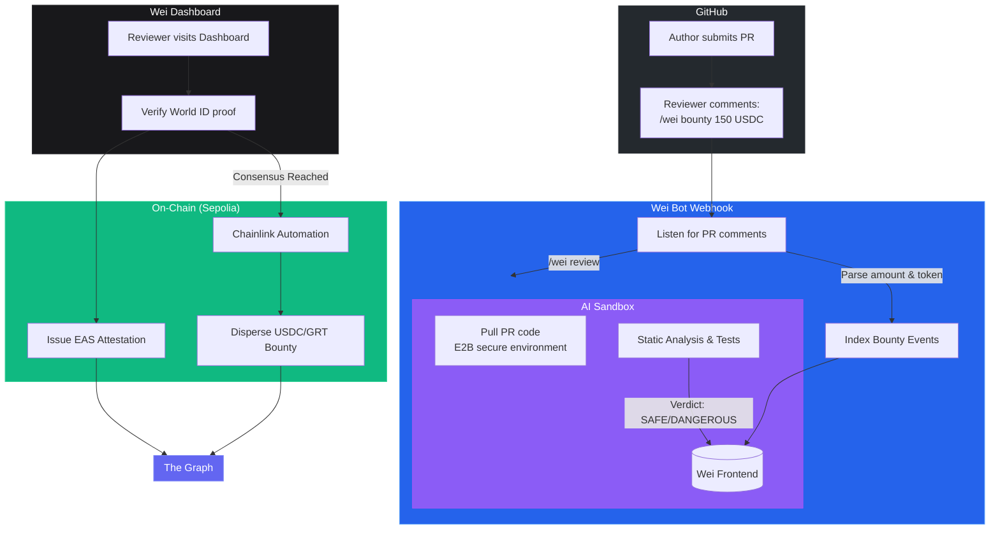

# Wei

Decentralized PR workflow automation for protocol upgrades (like EIPs and GIPs). Wei accelerates governance by automating PR reviews, incentivizing reviewers with USDC/GRT bounties, ensuring Sybil resistance via World ID, and recording reputations on-chain with EAS.

Legacy governance processes (like `eip-review-bot` or forum polls) are slow, purely volunteer-driven, and vulnerable to bot farms. Wei solves this by bringing accountability, financial incentives, and AI static analysis directly to GitHub PR comments.

## How it works



## Live Services

| Component | Description |
|---|---|
| Frontend Dashboard | Next.js App Router (Hosted on Vercel) |
| GitHub Webhook API | `/api/github/webhook` (Connect via ngrok) |
| Smart Contract | `NexusCore.sol` on Sepolia Testnet |
| Identity | World ID Integration |
| Oracle | Chainlink Functions & Automation |
| Indexing | The Graph (Custom Sepolia Subgraph) |

## Quick Start

### 1. Run the local development server

```bash
cd dashboard
npm install
npm run dev
```

Visit `http://localhost:3000` to view the landing page and `http://localhost:3000/bounties` to access the App Dashboard.

### 2. Test the GitHub Webhook (Live Demo setup)

To demonstrate the GitHub PR automation live:

1. Start `ngrok` to expose your local port:
```bash
ngrok http 3000
```
2. Navigate to your test GitHub Repository > **Settings** > **Webhooks**.
3. Add a new webhook:
   - **Payload URL**: `https://<your-ngrok-url>.ngrok.app/api/github/webhook`
   - **Content type**: `application/json`
   - **Secret**: `super_secret_webhook_key_12345`
   - **Events**: Select **Issue comments** and **Pull requests**.
4. Open a PR in your repository and add a comment:
```
/wei bounty 150 USDC
```
5. Check your local terminal. You will see the Wei Bot webhook intercept the comment and initiate the bounty!